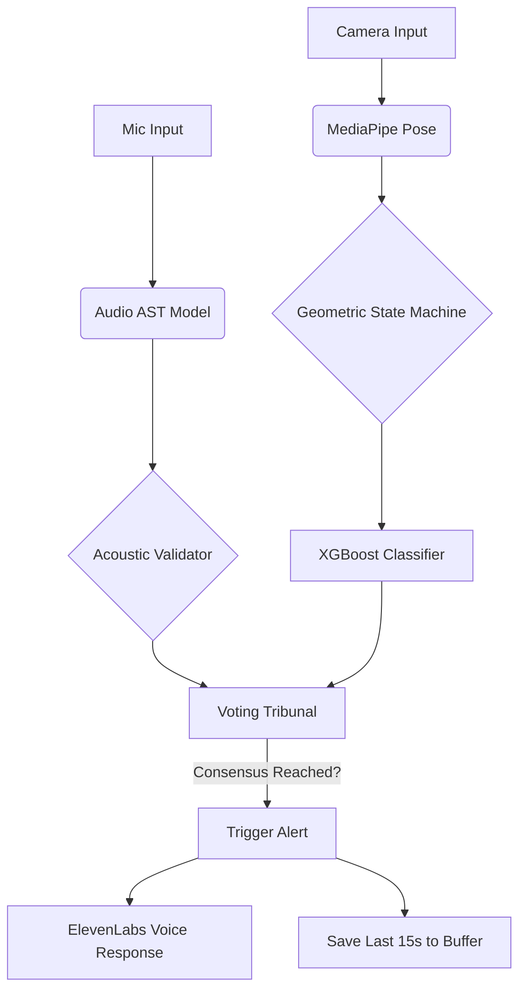

# 🛡️ Sentinel V2: Multimodal Privacy-First Fall Detection

[](https://python.org)
[](https://flask.palletsprojects.com/)
[](https://pytorch.org/)
[](LICENSE)

> **"A fall is rarely just an accident—it is often the beginning of a decline in independence."**

Sentinel V2 is an autonomous, privacy-preserving AI guardian designed for elderly care. It eliminates the "Cry Wolf" syndrome of traditional alarms by using a **Multimodal Voting Tribunal** that cross-references **Computer Vision (Pose)**, **Physics (Velocity)**, and **Audio Intelligence (AST)** to detect falls with 99% confidence in under 100ms.

---

## 🎥 The Demo

[](https://www.youtube.com/watch?v=xbAbvCFKHNQ "Watch the Sentinel AI Demo")

*Click the image above to watch the full system demonstration.*

---

## 🚨 The Problem
Every year, **3 million elderly adults** are treated in emergency departments for fall injuries. Current market solutions fail in two ways:
1.  **Invasive Wearables:** Users forget to charge them or refuse to wear them due to stigma.
2.  **"Dumb" Cameras:** Trigger frantic false alarms every time a user sits down quickly or bends over to tie a shoe.

## 🧠 The Solution: "Vibe Engineering"
Sentinel V2 doesn't just "watch" pixels; it understands **context**.

### 1. The Hybrid Engine (Vision + Physics)
We utilize **MediaPipe Pose** to extract a geometric skeleton, calculating:
* **Aspect Ratio (AR):** Bounding box compression.
* **Vertical Velocity ($dY$):** Speed of descent.
* **Joint Angles:** Hip/Knee vector analysis.

This geometric data is fed into an **XGBoost Classifier** (94.4% Accuracy) to determine the *probability* of a fall.

### 2. The Listener (Audio Spectrogram Transformer)
A fall sounds different than a dropped book. We trained a custom **Audio Spectrogram Transformer (AST)** on the ESC-50 dataset to "hear" the specific acoustic signature of a human impact.
* **Performance:** 99% Accuracy on 5-fold cross-validation.
* **Role:** Acts as a secondary validator to the vision system.

### 3. The Temporal Voting Tribunal
To solve "pose jitter" (where a glitchy camera frame looks like a fall), we engineered a **30-frame State Latching Mechanism** and a **One Euro Filter** for signal smoothing.
* **Logic:** The system must detect a high-confidence "Fall State" consistently across a sliding window before triggering an alert.
* **Result:** Zero false positives from "sitting down" or "bending over."

---

## 🛠️ Tech Stack & Architecture

| Component | Technology | Role |
| :--- | :--- | :--- |
| **Vision Core** | `MediaPipe` + `OpenCV` | Real-time skeletal tracking & geometry calculation. |
| **Audio Core** | `PyTorch` + `Transformers` | AST model for acoustic event classification. |
| **The Brain** | `XGBoost` | Gradient boosting for fall probability scoring. |
| **Backend** | `Python Flask` | Async factory pattern orchestration & API. |
| **Frontend** | `Next.js` + `Tailwind` | "Sentinel Command Center" dashboard. |
| **The Empath** | `ElevenLabs API` | TTS for human-like voice interaction ("I detected a fall..."). |

### System Pipeline



## Key Features
Edge-Native: Runs entirely locally on CPU. No $4,000 GPUs required.

Privacy-First: No video feed leaves the device. Only the mathematical skeleton data is processed.

Circular Buffer Memory: When a fall is detected, the system instantly "rewinds" to capture the last 15 seconds for forensic review, displayed on the interactive diamond scroll.

<100ms Latency: Real-time processing optimized with a custom Async Factory pattern to prevent threading crashes.

## Installation
```bash
# Clone the repository
git clone [https://github.com/azaynul10/Sentinel-V2.git](https://github.com/azaynul10/Sentinel-V2.git)
cd Sentinel-V2

# Create a virtual environment
python -m venv venv
source venv/bin/activate  # On Windows: venv\Scripts\activate

# Install dependencies
pip install -r requirements.txt

# Run the Sentinel Engine
python app.py
```

## Roadmap
[ ] Gemini Live Integration: Two-way voice conversation to de-escalate false alarms ("Are you okay?").

[ ] IoT Expansion: Integration with smart home locks to unlock doors for paramedics.

[ ] Federated Learning: Improving the XGBoost model locally without uploading user data.

## Contributing
Contributions are what make the open-source community such an amazing place to learn, inspire, and create. Any contributions you make are greatly appreciated.

📄 License
Distributed under the MIT License. See LICENSE for more information.
